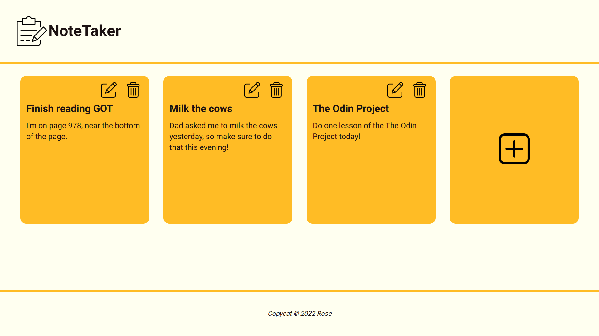
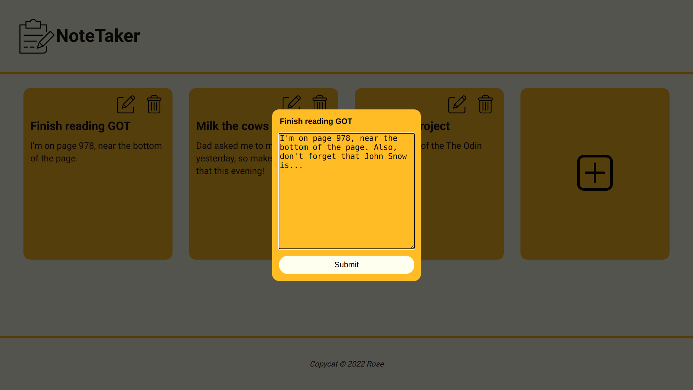
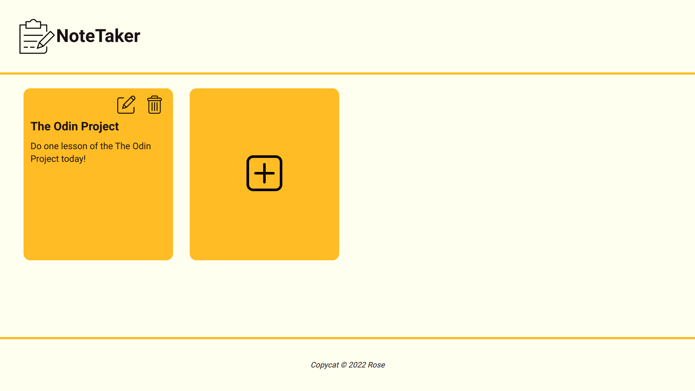

# NoteTaker

This project uses local storage, [Webpack](https://webpack.js.org/), JS modules, and the [uniqid](https://www.npmjs.com/package/uniqid) package from npm! The code may not be highly efficient but it is clean, DRY, and organized (check out the src/ for proof). 

[Link to live demo.](https://rosendo-martinez.github.io/note-taker/) 👈

NoteTaker Features: 
 - Create/edit/delete notes
 - Notes automatically saved to local storage

# Screenshots 

